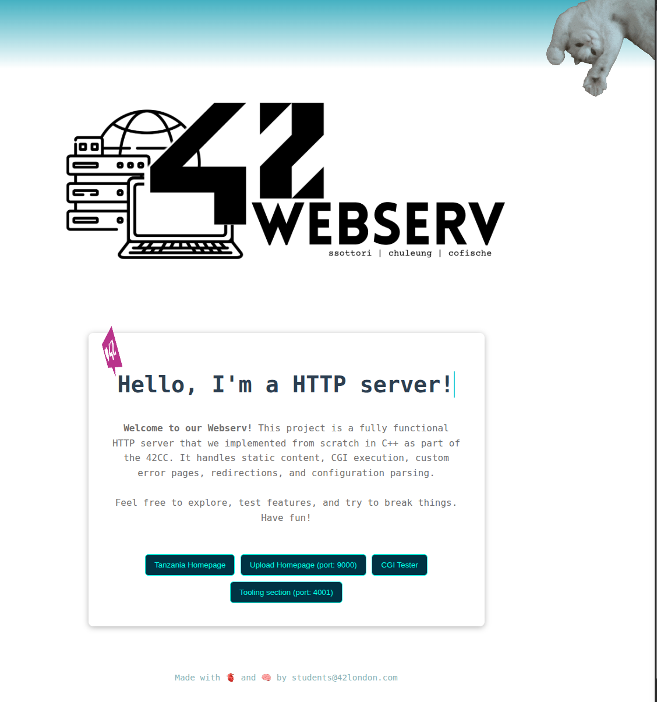
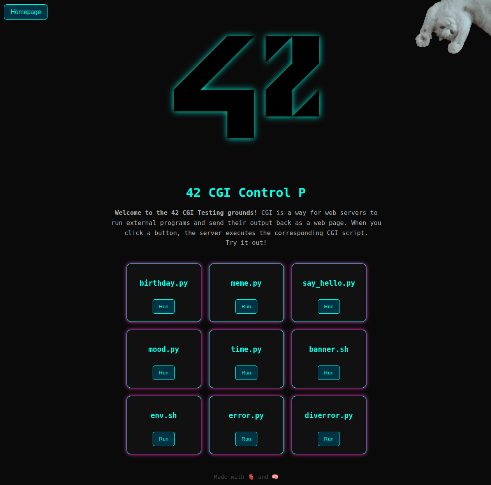
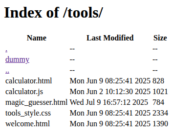

# HTTP Webserver - Custom Implementation

> A high-performance HTTP/1.1 webserver built from scratch in C++, implementing core web server functionality including request parsing, response generation, CGI support, file uplaod, static website display and multi-client handling.

## ✨ Features

- **HTTP/1.1 Protocol** - Full implementation of HTTP/1.1 specifications
- **Static File Serving** - Efficient serving of HTML, CSS, JS, images, and other static content
- **CGI Support** - Execute dynamic scripts and applications
- **Configuration File** - Flexible server configuration via config files
- **Multi-Client Handling** - Concurrent connection management using epoll
- **File Upload** - Support for POST requests with file uploads (in development)
- **Virtual Hosts** - Multiple website hosting on single server instance
- **Non-blocking I/O** - Asynchronous request processing
- **Error Handling** - Proper HTTP status codes and error pages
- **AutoIndex** - Display a crafted HTML webpage listing the available folder/files within an URL, if authorised
- **Redirection** - send redirection URL to browser for specific URL requests

## 🛠️ Tech Stack

**Core Technologies:**
- **C++98** - Systems programming with object-oriented design
- **Socket Programming** - Low-level network communication
- **HTTP/1.1 Protocol** - RFC 7230-7235 compliance
- **CGI 1.1** - Common Gateway Interface for dynamic content

**Key Concepts Implemented:**
- Non-blocking I/O with epoll
- HTTP request parsing and validation
- Process management for CGI execution
- Memory management and resource cleanup
- Signal handling and graceful shutdown

## 📱 Screenshots









## 🚀 Quick Start

### Prerequisites
- C++ compiler (g++ or clang++)
- Make utility
- Unix-like operating system (Linux, macOS)

### Installation

1. **Clone the repository**
   ```bash
   git clone https://github.com/yourusername/webserver.git webserver
   cd webserver
   ```

2. **Compile the server**
   ```bash
   make
   ```

3. **Run with default configuration**
   ```bash
   # webserver with default configuration file
   ./webserv

   # Webserver with custom configuration file
   ./webserv config/your_filename.conf
   ```

4. **Test the server**
   ```bash
   curl http://localhost:8080
   # or open in browser
   ```

## ⚙️ Configuration

### Basic Configuration Example

```nginx
# config/server.conf
server {	
	host: 127.0.0.1
	port: 8080 8081 8082
	server_names: Example.com www.example.com
	client_max_body_size: 10M
	error_pages {
		404 /documents/errors/404.html
		500 /documents/errors/500.html
	}

	location /location_name {
		root: folder_path
		methods: GET POST DELETE 
		index: filename_index
	}
}
```

## 🔧 HTTP Methods Supported

| Method | Status | Description |
|--------|--------|-------------|
| `GET` | ✅ Complete | Retrieve resources, CGI |
| `POST` | ✅ In progress | Submit data, file uploads, CGI |
| `DELETE` | ✅ In progress | Delete resources |

## 🧪 Testing

```bash
# Run unit tests
make debug; ./webserv > output

# Test different HTTP methods
curl -X GET http://localhost:8080/
curl -X DELETE http://localhost:8080/file.txt

# Test file upload
curl -X POST -F "file=@test.txt" http://localhost:8080/upload/

# Test CGI
curl http://localhost:8080/cgi-bin/info.py

# Stress test with Apache Bench
ab -n 1000 -c 10 http://localhost:8080/
```

### Available Test Scripts

```bash
# standard tester script
make tester

# tester script + debbuging output available
# !! The debugger limits the loops to 2000 !!
make tester-debug

# tester script + valgrind
# !! Increasing the timeout for cgi and concurrence testing functions !!
make tester-leaks
```

## 🔧 Building and Compilation

```bash
# Standard build
make

# Clean build files
make clean

# Complete clean
make fclean

# Rebuild everything
make re
```

## 📚 Learning Resources

- [RFC 7230 - HTTP/1.1 Message Syntax](https://tools.ietf.org/html/rfc7230)
- [RFC 7231 - HTTP/1.1 Semantics](https://tools.ietf.org/html/rfc7231)
- [CGI 1.1 Specification](https://tools.ietf.org/html/rfc3875)
- [HTTP Server Development Guide](https://developer.mozilla.org/en-US/docs/Web/HTTP)
- [42 School Webserv Subject](https://cdn.intra.42.fr/pdf/pdf/123456/en.subject.pdf)

## 🔧 Troubleshooting

### Enable Debugging message
```bash
make debug
./webserv > output
```

### Common Issues

**Port already in use:**
```bash
# Check what's using the port
lsof -i -P -n | grep LISTEN
# If all the LISTEN belong to the same PID process (webserver ones)
kill {webserv PID} 
```

**Permission denied:**
```bash
# Make sure you have permissions for the port
sudo ./webserv  # For ports < 1024
```

**CGI scripts not executing:**
```bash
# Check script permissions
chmod +x www/cgi-bin/script.py
# Check script outside program
./script.py
# Verify interpreter path in config
```

**High memory usage:**
```bash
# Run with Valgrind to check for leaks
make leaks
```

## 📝 License

This project is part of the 42 School curriculum and follows their academic guidelines.

## 👨‍💻 Authors

**Coline Fischer** & **Chung Fan Leung** & **Shaly**

- GitHub: [@CymF96](https://github.com/CymF96)
- GitHub: [@pejasco](https://github.com/pejasco)
- GitHub: [@pandashaly](https://github.com/pandashaly)


## 🏆 42 School Project

This project demonstrates mastery of:
- **Network Programming** - Socket programming and HTTP protocol implementation
- **Systems Programming** - Process management, I/O multiplexing, and resource handling
- **Software Architecture** - Object-oriented design and modular code structure  
- **Web Technologies** - Understanding of web server internals and HTTP standards
- **Performance Optimization** - Efficient handling of concurrent connections

**Skills Developed:**
- HTTP/1.1 protocol implementation
- Socket programming and network I/O
- CGI and dynamic content generation
- Configuration file parsing
- File uploading system
- Multi-client connection handling
- Memory and resource management
- Error handling and logging
- Performance testing and optimization

**Technical Challenges Overcome:**
- Non-blocking I/O implementation
- HTTP request parsing edge cases
- CGI process management and communication
- Perfomance management in sharing big size documents
- URI-URL reformatting to access correct resources
- Concurrent connection scaling
- RFC compliance and standards adherence

**Grade:** 110/120

